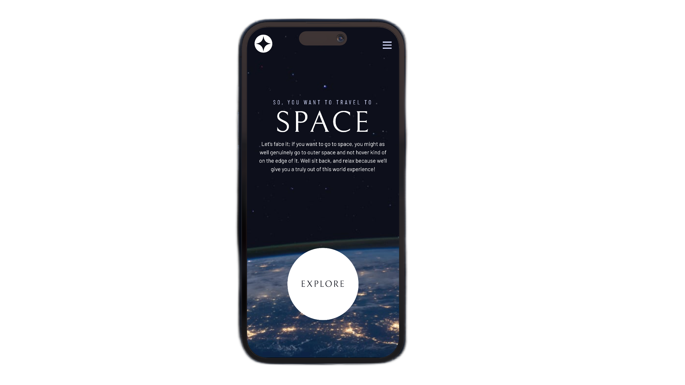
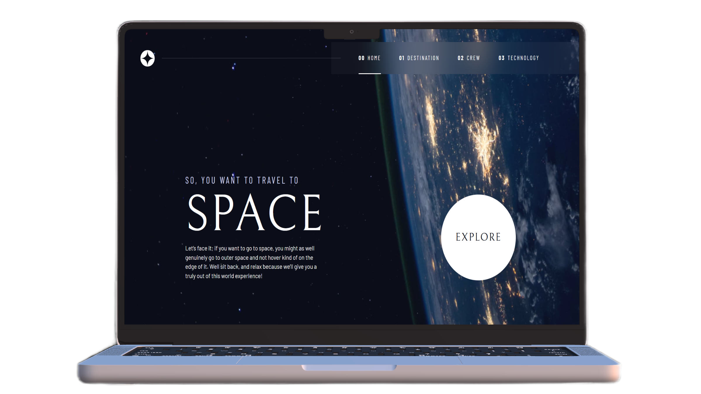

# Frontend Mentor - Space tourism website solution

This is a solution to the [Space tourism website challenge on Frontend Mentor](https://www.frontendmentor.io/challenges/space-tourism-multipage-website-gRWj1URZ3). Frontend Mentor challenges help you improve your coding skills by building realistic projects.

## Table of contents

- [Frontend Mentor - Space tourism website solution](#frontend-mentor---space-tourism-website-solution)
  - [Table of contents](#table-of-contents)
  - [Overview](#overview)
    - [The challenge](#the-challenge)
    - [Screenshot](#screenshot)
    - [Links](#links)
  - [My process](#my-process)
    - [Built with](#built-with)
    - [What I learned](#what-i-learned)
      - [CSS custom properties](#css-custom-properties)
      - [`.sr-only` class](#sr-only-class)
      - [Skip to content button](#skip-to-content-button)
      - [`<header>` and `<main>` elements](#header-and-main-elements)
      - [Animated hamburger menu](#animated-hamburger-menu)
      - [Using `::before` and `::after` pseudo elements](#using-before-and-after-pseudo-elements)
      - [`defer` attribute](#defer-attribute)
      - [ARIA attributes](#aria-attributes)
      - [`clamp()` function](#clamp-function)
    - [Continued development](#continued-development)
  - [Author](#author)
  - [Acknowledgments](#acknowledgments)

## Overview

### The challenge

Users should be able to:

- View the optimal layout for each of the website's pages depending on their device's screen size
- See hover states for all interactive elements on the page
- View each page and be able to toggle between the tabs to see new information

### Screenshot




### Links

- [Solution URL](#)
- [Live Site URL](https://ohsorrow.github.io/Space-tourism-website/)

## My process

### Built with

- Semantic HTML5 markup
- CSS custom properties
- CSS Grid
- CSS transitions
- Flexbox
- Mobile-first workflow
- Accessible web standards

### What I learned

Reflecting on this project, I gained valuable skills and knowledge. Utilizing CSS custom properties proved an excellent technique for organizing code. They enabled me to efficiently adjust colors, fonts, and other styles site-wide. Additionally, implementing CSS transitions brought interactivity and dynamics to page elements.

The design files from Figma provided an invaluable reference point for accurately matching the visual specifications. With the combination of modern CSS techniques and a professional design file, I was able to closely match the intended aesthetics.

Overall, this project served as great practice for modern CSS techniques like custom properties and transitions. Following an organized design file also strengthened my skills in accurately matching visual specifications. I'm proud of the end result and grateful for the valuable real-world development experience this project provided.

#### CSS custom properties

In this code snippet, I utilized CSS custom properties and HSL color values for efficient style management.

Defining colors in HSL enables easy hue adjustments through changing a single value. It also allows modifying opacity via the alpha channel. Notably, when declaring custom properties, HSL values are written without the hsl() function.

Additionally, I defined font size and family as custom properties. This technique centralizes style declarations, enabling site-wide changes by modifying a single value.

```css
:root {
  /* colors */
  --clr-dark: 230 35% 7%;
  --clr-light: 231 77% 90%;
  --clr-white: 0 0% 100%;

  /* font-sizes */
  --fs-900: clamp(5rem, 9vw + 1rem, 9.375rem);
  --fs-800: 3.5rem;
  --fs-700: 1.75rem;
  --fs-600: 1.5rem;
  --fs-500: 1rem;
  --fs-400: 0.9375rem;
  --fs-300: 0.875rem;

  /* font-families */
  --ff-serif: "Bellefair", serif;
  --ff-sans-cond: "Barlow Condensed", sans-serif;
  --ff-sans-normal: "Barlow", sans-serif;
}
```

#### `.sr-only` class

Applying the `.sr-only` class enables visually hiding elements while keeping them readable by assistive technologies.

```css
.sr-only {
  position: absolute;
  width: 1px;
  height: 1px;
  padding: 0;
  margin: -1px;
  overflow: hidden;
  clip: rect(0, 0, 0, 0);
  white-space: nowrap; /* added line */
  border: 0;
}
```

#### Skip to content button

Adding a "Skip to Content" button enhances accessibility by enabling quick navigation to main content.

Implementing a "Skip to Content" link allows users, especially those not using a mouse, to bypass repetitive site navigation and jump directly to the main content. This improves the experience for:

- Keyboard-only users

- Screen reader users

- Those with motor impairments limiting mouse use

By adding a Skip to Content link that becomes visible on focus, we accommodate users who can't or don't want to tab through repetitive site sections. This enables efficiently bypassing things like navigation menus.

```css
.skip-to-content {
  position: absolute;
  left: 1rem;
  z-index: 9999;
  background: hsl(var(--clr-white) / 0.03);
  backdrop-filter: blur(1rem);
  color: hsl(var(--clr-light));
  padding: 0.5em 1em;
  margin-inline: auto;
  border-radius: 0.5rem;
  transform: translateY(-100%);
  transition: transform 0.5s ease-in-out;
}

.skip-to-content:focus {
  transform: translateY(10%);
}
```

#### `<header>` and `<main>` elements

Using `<header>` and `<main>` elements improves accessibility by demarcating key page sections.

Implementing distinct `<header>` and `<main>` elements divides the page into logical zones. This makes it clear to assistive technologies like screen readers where key sections begin and end.

#### Animated hamburger menu

I learned how to create an animated hamburger menu using CSS.

```css
.mobile-nav-toggle {
  border: 0;
  display: flex;
  align-items: center;
  position: absolute;
  z-index: 2000;
  right: 1rem;
  top: 1.75rem;
  width: 32px;
  height: 32px;
  background-color: transparent;
}

.menu-icon,
.menu-icon::before,
.menu-icon::after {
  display: block;
  width: 24px;
  height: 3px;
  background-color: hsl(var(--clr-light));
  transition: all 0.5s;
}
.menu-icon::before,
.menu-icon::after {
  content: "";
}
.menu-icon::before {
  transform: translateY(-8px);
}
.menu-icon::after {
  transform: translateY(5px);
}

.mobile-nav-toggle[aria-expanded="true"] .menu-icon {
  background-color: transparent;
  transform: rotate(360deg);
}
.mobile-nav-toggle[aria-expanded="true"] .menu-icon::before {
  transform: rotate(45deg);
}
.mobile-nav-toggle[aria-expanded="true"] .menu-icon::after {
  transform: translateY(-3px) rotate(-45deg);
}
```

#### Using `::before` and `::after` pseudo elements

`::before` and `::after` pseudo elements helped me to create a glow effect on the Explore button.

```css
.large-button {
  padding: 0 1.5em;
  display: inline-grid;
  place-content: center;
  border-radius: 50%;
  aspect-ratio: 1/1;
  position: relative;
  z-index: 1;
}

.large-button::before {
  content: "";
  width: 100%;
  height: 100%;
  position: absolute;
  z-index: -1;
  border-radius: 50%;
  background-color: hsl(var(--clr-white) / 0.15);
  opacity: 0;
  transition: opacity 0.5s linear, transform 0.75s ease-in-out;
}

.large-button:hover::before,
.large-button:focus::before {
  transform: scale(1.5);
  opacity: 1;
}
```

#### `defer` attribute

Using `defer` attribute in script tag will make the browser to load the script after the HTML is parsed. So it will make the page load faster.

```html
<script src="index.js" defer></script>
```

#### ARIA attributes

I learned how to use ARIA attributes to make the page more accessible. For example I used `aria-expanded` attribute to indicate whether the mobile menu is open or not. We can also use `aria-label` attribute to give a name to the hamburger menu button. I used `aria-current` attribute to indicate the current page in the navigation bar. We can also use `aria-hidden` attribute to hide the element from assistive technologies. I used it to hide the indicator numbers in the navigation bar.

#### `clamp()` function

I used `clamp()` function to make the page more responsive. For example in the code snippet below I used `clamp()` function to make the font size responsive. The font size will be 5rem on small screens and 9.375rem on large screens. It will be responsive in between.

```css
--fs-900: clamp(5rem, 9vw + 1rem, 9.375rem);
```

### Continued development

Though I'm pleased with my progress, web development offers endless room for improvement. I'm excited to keep refining my skills in future projects. Consistently learning and challenging myself is what helps me grow as a developer.

## Author

My profile on:

- [Frontend Mentor](https://www.frontendmentor.io/profile/OhSorrow)
- [LinkedIn](https://www.linkedin.com/in/aram-moradian/)

## Acknowledgments

I followed Kevin Powell's course on interactive learning platform [Scrimba](https://scrimba.com/) to finish this project. I really appreciate his work. I learned a lot from him. I highly recommend his courses to anyone who wants to learn web development. You can find his courses [here](https://scrimba.com/learn/spacetravel).
